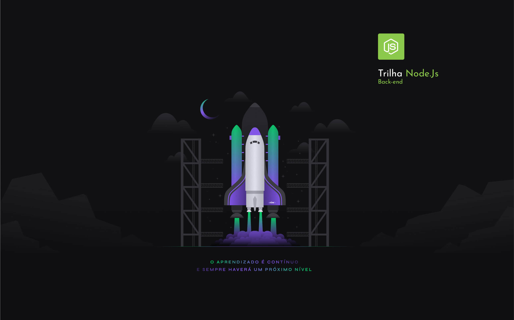

<div align="center">
    
</div>

<div align="center">
    
    
    
    <p>    
        Feito com 💜 by <a href="https://www.linkedin.com/in/abdielmartins/" target="_blank">Abdiel Martins</a>
    </p>
</div>

<h4 align="center">
</h4>

<br>

# 🚀 Projeto

Durante esta **Next Level Week** foi desenvolvida uma API Restful para Net Promoter Score.

> O **Net Promoter Score** é uma metodologia de satisfação de clientes desenvolvida para avaliar o grau de **fidelidade dos clientes** de qualquer perfil de empresa.

<br>

## Iniciando a jornada

Se você estiver iniciando a jornada e não tem muita familiariadade com alguns conceitos, esse guia definitivamente irá lhe ajudar: [Guia Next Level Week #4](https://www.notion.so/Next-Level-Week-4-Node-js-67981103adbb4f229187c802bcd0d787)

<br>

# 📝 Sobre

As aulas foram ministradas pela **[Daniele Leão](https://github.com/danileao)** instrutora da [Rocketseat](https://rocketseat.com.br/)

<br>

# 🚧 Instalação

## Dependências

```
$ yarn install
```

## Iniciar Aplicação

```
$ yarn dev
```

<br>

# 🔃 Rotas

Abaixo segue descrição das rotas e das requisições. Nenhuma das rotas necessita de autenticação.

## Listando pesquisas

`GET /surveys - FORMATO DA RESPOSTA - STATUS 200`

```json
[
  {
    "id": "f853d58e-08bb-4935-8d28-fec5aa567bcb",
    "title": "Queremos ouvir sua opnião",
    "description": "De 0 a 10 quanto você recomendaria a Rocketseat",
    "created_at": "2021-02-24T21:46:18.000Z"
  },
  {
    "id": "42146016-24fe-4db5-a74e-2b6033946986",
    "title": "Queremos ouvir sua opinião",
    "description": "lorem ipsum dolor sit amet consectetur adipiscing elit",
    "created_at": "2021-02-28T14:08:49.000Z"
  },
  {
    "id": "1d7ce176-7580-4d0d-838f-3f940116ea69",
    "title": "Queremos ouvir sua opinião Abdiel",
    "description": "lorem ipsum dolor sit amet consectetur adipiscing elit",
    "created_at": "2021-02-28T14:19:30.000Z"
  }
]
```

## Criando pesquisas

`POST /surveys - FORMATO DA REQUISIÇÃO`

```json
{
  "title": "Queremos ouvir sua opinião Abdiel",
  "description": "lorem ipsum dolor sit amet consectetur adipiscing elit"
}
```

`POST /surveys - FORMATO DA RESPOSTA - STATUS 200`

```json
{
  "id": "1d7ce176-7580-4d0d-838f-3f940116ea69",
  "title": "Queremos ouvir sua opinião Abdiel",
  "description": "lorem ipsum dolor sit amet consectetur adipiscing elit",
  "created_at": "2021-02-28T14:19:30.000Z"
}
```

## Criando usuários

`POST /users - FORMATO DA REQUISIÇÃO`

```json
{
  "name": "Abdiel Martins",
  "email": "abdielmartins21@gmail.com"
}
```

`POST /users - FORMATO DA RESPOSTA - STATUS 200`

```json
{
  "id": "7f5289f8-fdc5-4598-8c48-6d6e57b571b2",
  "name": "Abdiel Martins",
  "email": "abdielmartins22@gmail.com",
  "created_at": "2021-02-28T14:08:45.000Z"
}
```

## Criando pesquisas

`PATCH /sendMail - FORMATO DA REQUISIÇÃO`

```json
{
  "email": "abdielmartins22@gmail.com",
  "survey_id": "1d7ce176-7580-4d0d-838f-3f940116ea69"
}
```

`PATCH /update - FORMATO DA RESPOSTA - STATUS 200`

```json
{
  "id": "5f5dc218-6204-4bbd-828b-8fd7b11a659f",
  "user_id": "7da56d63-29be-43d1-a3e6-414675b55ed4",
  "survey_id": "f853d58e-08bb-4935-8d28-fec5aa567bcb",
  "value": null,
  "created_at": "2021-02-26T01:03:35.000Z",
  "user": {
    "id": "7da56d63-29be-43d1-a3e6-414675b55ed4",
    "name": "Abdiel",
    "email": "abdielmartins21@gmail.com",
    "created_at": "2021-02-24T00:22:31.000Z"
  },
  "survey": {
    "id": "f853d58e-08bb-4935-8d28-fec5aa567bcb",
    "title": "Queremos ouvir sua opnião",
    "description": "De 0 a 10 quanto você recomendaria a Rocketseat",
    "created_at": "2021-02-24T21:46:18.000Z"
  }
}
```
